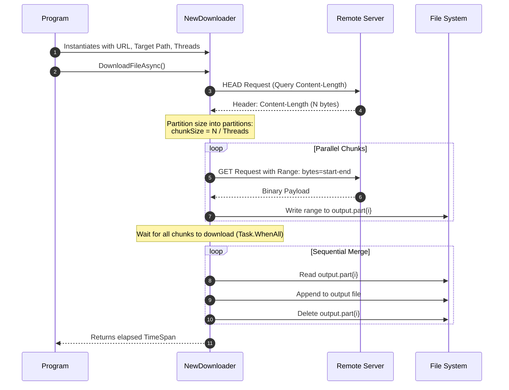

# SplitStream: Multi-Threaded Parallel Downloader in .NET 10

A high-performance, asynchronous multi-threaded file download utility implemented in C# targeting **.NET 10.0**. This project demonstrates chunk-based parallel downloading using HTTP range requests, stream merging techniques, progress tracking, and pause/resume mechanics.

---

## Architecture Overview


1. **Multi-Threaded Parallel Chunking:** Splitting a remote file into mathematical byte offsets based on the target thread count, downloading those chunks concurrently in separate streams to disk, and merging them sequentially.




---


## Technical Deep-Dive


*   **Parallel Fetching**: Each block is retrieved concurrently by calling `HttpClient.SendAsync` with a `RangeHeaderValue` set to the specific `start` and `end` byte offsets.
*   **Disk Offloading**: Stream reading is handled using an optimized 4KB buffer (`FileStream` opened with `useAsync: true` for non-blocking I/O) to output directly to intermediate files named `<outputPath>.part{i}`
*   **Sequential Assembly**: Once all partition requests complete successfully (`Task.WhenAll`), each partition sequentially merges into the final file using `CopyToAsync`, deletes the partial files, and recovers storage.


## How to Build & Run

### Prerequisites

*   [.NET 10.0 SDK](https://dotnet.microsoft.com/en-us/download/dotnet/10.0)

### Building the Project

Run the following commands from the root solution folder 

```powershell
# Restore dependencies and build the solution in Release configuration
dotnet build --configuration Release
```

Note: SplitStream is under very early access.